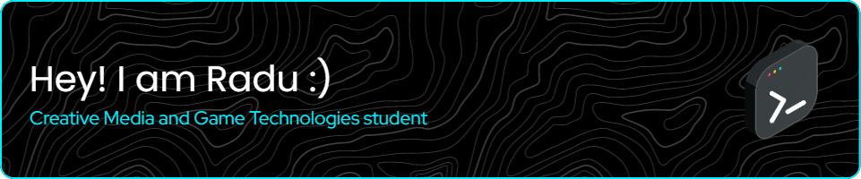

 
  
  
## Glad to see you here!  
I’m a third-year student on my path to perfecting my abilities. I have experience with many different aspects of game development and I am familiar with programs and methodologies used in this domain. Currently, I am working on developing my game programming skills!  
  
   

## Languages and Tools  

  
 
 
 
 
 
 
 
 
 
 
 
 
 
 

  

   

## Github Stats  

  
  
  

 
   
